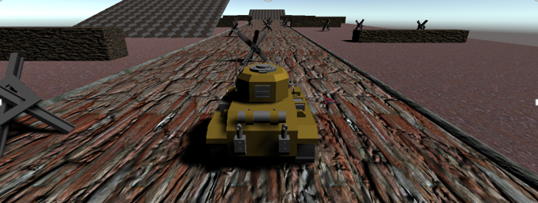
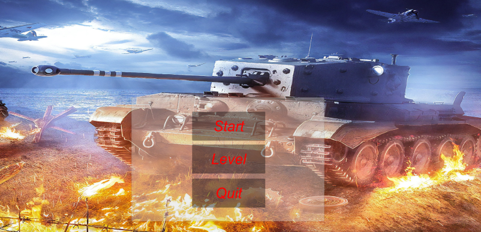

# game3Dlab1.5
## Game
The main mechanic in this genre is constant forward movement. In our case, the player cannot influence acceleration or stopping. Therefore, the player needs to navigate through obstacles in real-time, which adds more dynamism to the gameplay.

For the user, only gradual movement to the left or right is available by pressing the corresponding keys (or their touch screen equivalents if applicable).

As mentioned before, when colliding with barriers and anti-tank spikes, the level stops, and a corresponding message appears. When interacting with a "mine," the tank is randomly thrown in a certain direction, adding complexity to the gameplay. All of this is accompanied by appropriate sound effects.
State Assets implemented using Enums and Switches were also used for the character. This allows tracking the character's state (on the road, off-road, in flight). This system enabled the addition of certain gameplay mechanics.

The character's movement speed depends on its state. On the road, the speed is maximum, while off-road it is the slowest. During flight (tank bouncing), the character's control is blocked, meaning it cannot move left or right in the fly.

The ability to move on inclined surfaces has also been implemented by calculating the direction vector based on the surface normal and the previous direction vector.

### User Interface
The game features a simple and intuitively understandable user interface, consisting of:

1. Main Menu: The main menu serves as the central hub for the game and provides options for players to navigate through various features. 

2. Level Selection Tabs: The game includes level selection tabs, allowing players to choose different levels to play.

### Sound
One of the key components of the game is sound. Sound effects in video games provide excellent feedback to actions, enhancing the overall emotional impact and atmosphere of the game. Sounds have been added to correspond with various actions in the game, including the "Main Menu," "Jump," "Movement," and "Defeat" sounds. These sounds contribute to the immersive experience and help create a more engaging gameplay environment.
